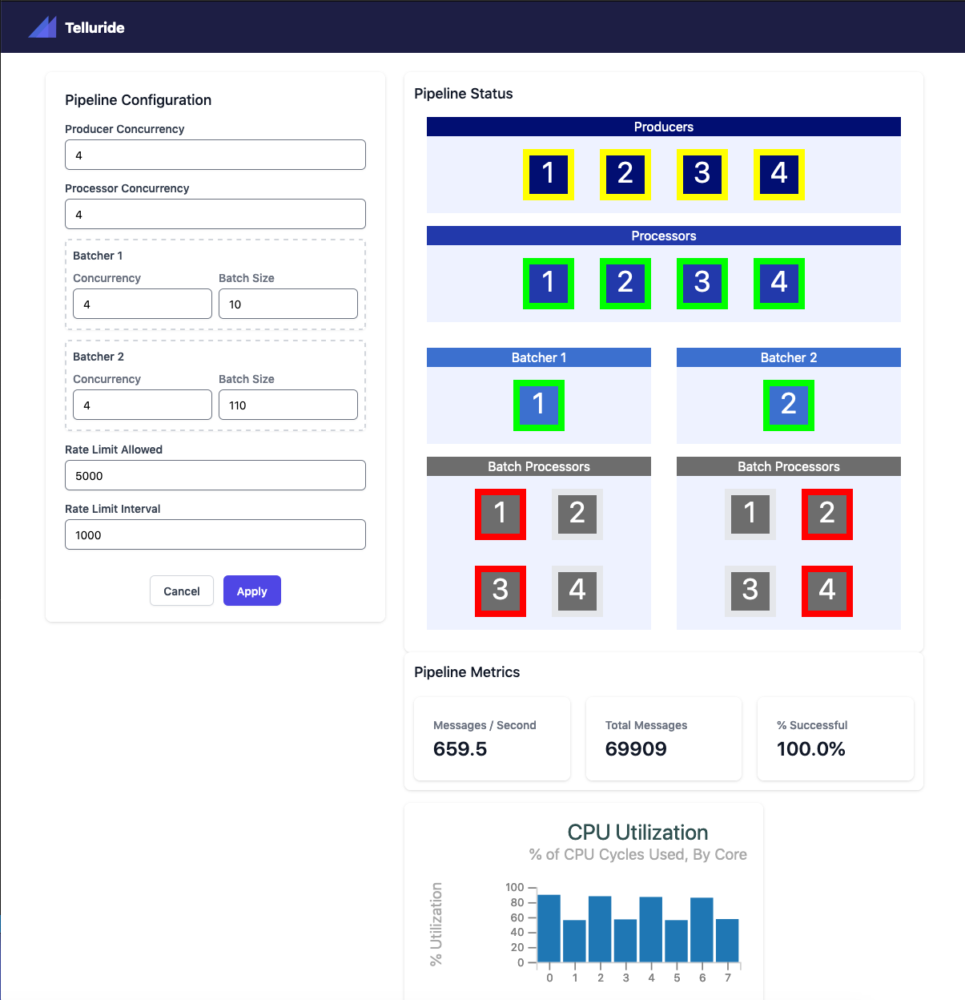

# TellurideUI

TellurideUI collaborates with [TelluridePipelime](https://github.com/brsg/telluride_pipeline) and [TellurideSensor](https://github.com/brsg/telluride_sensor) to provide an example of a [Broadway](https://github.com/dashbitco/broadway) pipeline consuming a stream of simulated IoT sensor reading messages from a `RabbitMQ` queue, in batches, computing some simple aggregate metrics over the stream of messages, and then publishlishing those metrics in a batch-oriented way to a queue on `RabbitMQ` by way of the [BroadwayRabbitMQ](https://github.com/dashbitco/broadway_rabbitmq) producer.  The point of this example is not the domain, which is contrived, but the mechanics of `Broadway` and Rabbit MQ working together.

TellurideUI implements a [Phoenix LiveView](https://github.com/phoenixframework/phoenix_live_view) dashboard that provides configuration and visualization of the Broadway pipeline. Here's an example screenshot:

<a href="assets/static/images/screenshot.png" target="_blank">Full Size</a>

## Stack

[Elixir](https://elixir-lang.org/)

[Phoenix Framework](https://www.phoenixframework.org/) (including [LiveView](https://github.com/phoenixframework/phoenix_live_view))

[RabbitMQ](https://www.rabbitmq.com/)

[Tailwind CSS 2](https://tailwindcss.com/)

[Alpine JS](https://github.com/alpinejs)

with:
* [amqp](https://github.com/pma/amqp) library
* [TailwindUI](https://tailwindui.com)

## Consulting or Partnership

If you need help with your Elixir projects, contact <info@brsg.io> or visit <https://brsg.io>.

## Acknowledgements

This project was inspired by Marlus Saraiva's ElixirConf 2019 talk [Build Efficient Data Processing Pipelines](https://youtu.be/tPu-P97-cbE).

## License and Copyright

Copyright 2021 - Blue River Systems Group, LLC - All Rights Reeserved

Licensed under the Apache License, Version 2.0 (the "License");
you may not use this file except in compliance with the License.
You may obtain a copy of the License at

    http://www.apache.org/licenses/LICENSE-2.0

Unless required by applicable law or agreed to in writing, software
distributed under the License is distributed on an "AS IS" BASIS,
WITHOUT WARRANTIES OR CONDITIONS OF ANY KIND, either express or implied.
See the License for the specific language governing permissions and
limitations under the License.